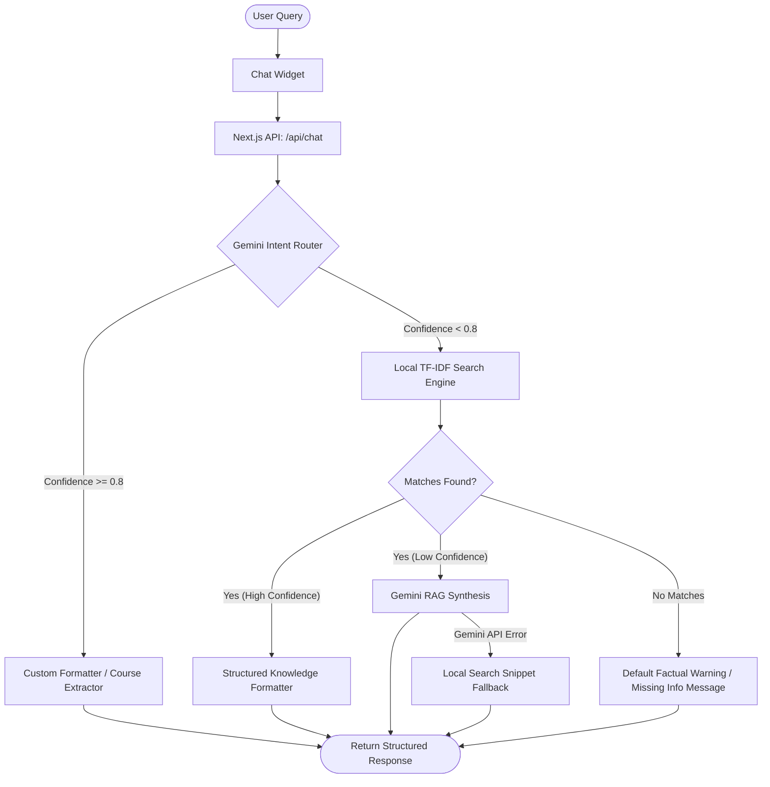

# Galgotias University Admission AI Chatbot

An intelligent, full-stack, Retrieval-Augmented Generation (RAG) chatbot application designed to assist prospective students with admissions, eligibility, fee structures, hostels, placement statistics, and school details for Galgotias University.

The project integrates a custom **Python web crawler** (to build the knowledge base) with a **Next.js (TypeScript + Tailwind CSS) web application** featuring a hybrid LLM/Search question-answering system powered by **Gemini 2.5 Flash**.

---

## 🏗️ System Architecture

The chatbot utilizes a hybrid routing and retrieval mechanism to ensure high factuality, low latency, and low operational costs.



### Key Architectural Concepts
1. **AI Intent Router**: Incoming queries are first classified by Gemini 2.5 Flash into predefined intents (e.g., `Admissions/Eligibility`, `Courses/B.Tech Fee Structure`). High-confidence intents bypass standard search and are processed directly using optimized formatters.
2. **Rule-Based Course Extractor**: Program-specific details (duration, eligibility, fees) are extracted from knowledge documents using customized regex-based parsers and formatted as bullet points or tables.
3. **Local TF-IDF Search Index**: A fast, client-side/serverless token-matching search engine computes document relevance based on term frequencies and boosts category matching without needing external vector databases.
4. **Factual RAG Synthesis**: For complex questions, relevant crawled page contents are fed as context to Gemini 2.5 Flash with strict prompts prohibiting hallucination.
5. **API Key Round-Robin & Failover**: API requests rotate through up to three configured Gemini API keys to handle rate limits and failover gracefully to local search snippets if all keys are exhausted.
6. **Feedback & Callbacks**: Negative responses trigger a client-side callback prompt allowing users to request a follow-up. Callback info (names, phone numbers) and general feedback are saved to local databases.

---

## 📁 Repository Structure

```text
university-ai-chatbot/
├── components/                 # React UI Components
│   ├── ChatWidget.tsx          # Wrapper for widget trigger & window
│   ├── ChatWindow.tsx          # Main Chat UI, feedback buttons, callback form
│   ├── ChatButton.tsx          # Chat trigger button with micro-animations
│   ├── MessageBubble.tsx       # Renders user & bot messages with markdown support
│   ├── Header.tsx              # Clone of university header
│   ├── Hero.tsx                # Landing section with slider banner
│   ├── AcademicCentres.tsx     # Showcases university highlights
│   ├── Schools.tsx             # List of schools & departments
│   └── Footer.tsx              # Clone of university footer
├── crawler/                    # Python Web Crawler
│   ├── requirements.txt        # Python library dependencies
│   ├── crawl_galgotias.py      # Main crawler script
│   └── __init__.py             # Python package marker
├── data/                       # Local JSON databases
│   ├── callbacks.json          # Form submission requests
│   └── feedback.json           # User satisfaction logs (thumbs up/down)
├── knowledge_clean/            # Generated chatbot knowledge base (670+ pages)
│   ├── index.json              # Fast registry of titles, categories, URLs
│   ├── summary_report.json     # Details of the latest crawl process
│   └── page_###.json           # Extracted clean text, title, category, and URL
├── lib/                        # Backend helper functions
│   ├── search.ts               # Local TF-IDF search engine & document ranker
│   ├── gemini.ts               # Gemini API connection, failover, & intent classifier
│   ├── catalog.ts              # Handlers for general topic sections
│   ├── courseDetails.ts        # Regular expression-based field extractors
│   ├── responseFormatter.ts    # String, table, and markup formatters
│   ├── formatters.ts           # Currencies, text limiters, & whitespace normalizers
│   └── sources.ts              # Citation generator and URL parser
├── pages/                      # Next.js Pages & API Endpoints
│   ├── _app.tsx                # Next.js core application shell
│   ├── index.tsx               # Main clone home page
│   └── api/
│       ├── chat.ts             # Main dialog pipeline (/api/chat)
│       ├── callback.ts         # Callback submission endpoint (/api/callback)
│       ├── feedback.ts         # Satisfaction feedback endpoint (/api/feedback)
│       ├── catalog.ts          # Catalog retrieval helper
│       └── course-detail.ts    # Course details helper
├── public/                     # Static assets (images, banners, logo)
├── styles/                     # Tailwind & global stylesheet overrides
├── tailwind.config.ts          # Tailwind design configurations
├── tsconfig.json               # TypeScript configurations
└── CRAWLER_README.md           # Original crawler detailed guidelines
```

---

## 🚀 Getting Started

### Prerequisites
- **Node.js** (v18 or higher)
- **npm** or **yarn**
- **Python** (3.8 or higher)
- One or more **Gemini API Keys** from [Google AI Studio](https://aistudio.google.com/)

---

### 🕸️ 1. Building the Knowledge Base (Crawler)

The crawler traverses the Galgotias University sitemap, extracts only pages relevant to admissions, strips layout boilerplates, and stores them in `knowledge_clean/`.

1. **Navigate to the crawler folder and set up a virtual environment:**
   ```bash
   cd crawler
   python3 -m venv .venv
   source .venv/bin/activate
   ```
2. **Install dependencies:**
   ```bash
   pip install -r requirements.txt
   ```
3. **Run the crawler:**
   ```bash
   python crawl_galgotias.py
   ```
   *Useful CLI flags:*
   - `--limit 20`: Limit crawling to the first 20 matching URLs (good for quick testing).
   - `--delay 1.0`: Throttle crawl rate (seconds between requests).
   - `--force`: Recrawl pages even if they already exist in `index.json`.
   - `--output-dir <path>`: Output folder path (defaults to `knowledge`).

---

### 💻 2. Running the Web Application (Next.js)

1. **Install JavaScript packages:**
   ```bash
   npm install
   ```
2. **Configure your environment variables:**
   Create a `.env.local` file in the root directory and add your Gemini API keys:
   ```env
   GEMINI_API_KEY_1=your_first_gemini_api_key_here
   GEMINI_API_KEY_2=your_second_gemini_api_key_here
   GEMINI_API_KEY_3=your_third_gemini_api_key_here
   ```
   *(The app will rotate between keys to maximize rate limits and prevent runtime interruption).*
3. **Start the development server:**
   ```bash
   npm run dev
   ```
4. **Access the application:**
   Open [http://localhost:3000](http://localhost:3000) in your web browser.

---

## 📡 API Reference

### `POST /api/chat`
Handles incoming questions from the user and returns the response alongside citations.
- **Request Body:**
  ```json
  {
    "message": "What are the eligibility requirements for MBA?",
    "category": "courses"
  }
  ```
- **Response Body:**
  ```json
  {
    "answer": "MBA Eligibility:\n• Passed Bachelor degree of minimum 3 years duration.\n• Obtained at least 50% marks (45% in case of candidates belonging to reserved category) in the qualifying examination.",
    "sources": [
      {
        "title": "Master of Business Administration (MBA)",
        "url": "https://www.galgotiasuniversity.edu.in/post-graduate/mba"
      }
    ]
  }
  ```

---

### `POST /api/feedback`
Logs thumbs-up or thumbs-down feedback for user questions.
- **Request Body:**
  ```json
  {
    "question": "What is the fee for B.Tech?",
    "feedback": "negative"
  }
  ```
- **Response Body:**
  ```json
  {
    "ok": true
  }
  ```
*Writes into [data/feedback.json](file:///home/websrp/project/university-ai-chatbot/data/feedback.json).*

---

### `POST /api/callback`
Saves user callbacks when they submit their details (primarily triggered after negative feedback).
- **Request Body:**
  ```json
  {
    "name": "Jane Doe",
    "phone": "9876543210",
    "question": "B.Tech placements data"
  }
  ```
- **Response Body:**
  ```json
  {
    "ok": true
  }
  ```
*Writes into [data/callbacks.json](file:///home/websrp/project/university-ai-chatbot/data/callbacks.json).*

---

## 🧪 Technical Implementation Details

### Hybrid Formatting Rules
- If the RAG response contains sources, they are filtered out of the text answer itself and parsed separately as clickable citations.
- Structured answers are rendered as styled lists or clean markdown tables to support easy parsing of admission/fee criteria.

### Text-Based Relevance Ranking
The scoring algorithm in [lib/search.ts](file:///home/websrp/project/university-ai-chatbot/lib/search.ts) ranks matching documents using a weighted formula:
$$\text{Score} = \text{IDF} \times (8 \times \text{TitleHits} + 3 \times \text{CategoryHits} + \text{ContentHits}) + \text{PhraseMatchBonus} + \text{CategoryIntentBonus}$$

- Title matched terms receive **8x weight**.
- Category matches receive **3x weight**.
- Precise substring phrase matches receive a **+12 bonus**.
- Category intent matching query tokens (such as `hostel`, `placement`, `fees`) receive a **+35 to +150 bonus** to make sure correct documents bubble to the top.

---

## 📄 License
This project is proprietary. Developed for Galgotias University clone implementation.
